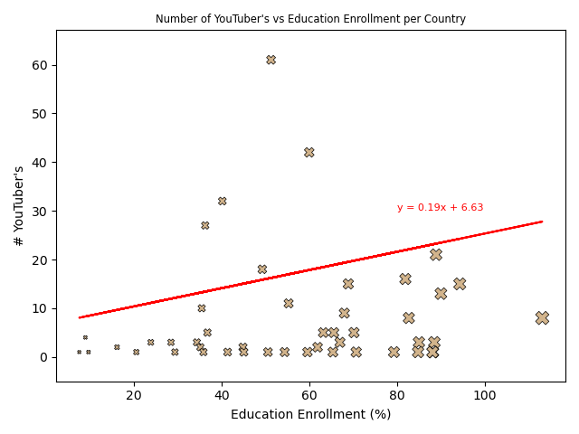
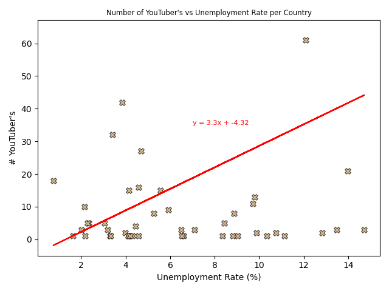

# Team Project_1

## Contents

1. [Project Description](#project-description)
2. [Dataset](#dataset-used)
3. [Questions/Analysis](#analysis-questions)
4. [Evaluation](#evaluation)
5. [References](#references)

## Project Description   

Investigate what factors may have contributed to the growth and popularity of YouTube channels globally and within their own countries.

## Dataset Used

[Global YouTube Satistics 2023 - Kaggle Dataset](https://www.kaggle.com/datasets/nelgiriyewithana/global-youtube-statistics-2023)

This dataset contains the top 995 YouTube channels by subscriber count, with key statistics for each channel such as:
    
   - Number of Video Views  
   - Total Video Uploads  
   - Estimaged monthly/annual earnings  
   - Originating Country  
   - Key statistics for each Country  
       - Population  
       - Unemployment Rate  
       - Education Enrollment Rate  

## Analysis Questions   

We identified four questions to generate analysis on. Each team member answered a question. The questions and analysis are:

### Q1 - Which country has the most video uploads per capita? ([@jkalsi1997](https://github.com/jkalsi1997))

Out of 197 countries in the world, 48 were used in the analysis of this dataset. 
Graph one, uploads in each country, shows the total amount of uploads from each country. From this we can gather that India has the most uploads out of all countries. This is likely due to the vastness of population and ethnic and cultual diverisity. 

Graph two, uploads per capita, shows how many uploads each country has given a sample of 1000 people. 
This involved incorporating another variable in the analysis where we include the population values. 

We can conlude that the country that has the most video uploads per capita in a sample of 1000 people is Singapore.

We also analysed the data further looking at the mean, median, standard deviation, standard error and variance of uploads in each country 
From that we can see that there are likely outliers in many countries in the Dataset. 

Countries such as India and Indonesia have incredibly high mean values which is possible due to a high level of some parameter, maybe population. 
Pakistan and Philippinwa demonstrates high variance and standard devaition values emphasises the large variance in data.
United Arab Emirates and Unites States have high standard error showing less precision in the calculated means. 

---

### Q2 - Which category is the most popular as a whole, and for each country? ([@Rafiullahmohammadzai](https://github.com/Rafiullahmohammadzai))

---

### Q3 - Does the Education Enrollment/Unemployment rate have a positive/negative correlation with the number of successful YouTube channels per country? ([@RJBarker](https://github.com/RJBarker))

#### Visuals

| Education Enrollment Rate vs Number of Channels per Country | Unemployment Rate vs Number of Channels per Country |
|----|----|
|  |  |

#### Analysis

Education Enrollment  
    
- With a Pearson r score of 0.1, there is a very weak positive correlation between the number of YouTuber's and their respective country's Education Enrollment rate.  
- This dataset is only concerned with the top ~800 Global channels. It would be intereseting to look into more detail and compare the results between countries with the top and bottom Education Enrollment rates, on a broader selection of channels to view the correlation.  

Unemployment

- Although there is a slightly stronger correlation between 'Unemployment Rate' and '# YouTuber's', than compared to 'Education Enrollment', this is still on the weaker side.  
- The linear regression and correalation values have most likely been skewed due to the 'United States' point plot which consists of 289 YouTuber's and a Unemployment Rate of near 15%.  

---

### Q4 - Looking at the year channels were created, which channel has gained popularity the quickest, is there a clear metric that has contributed to this? ([@brcaesar17](https://github.com/brcaesar17))

---

## Evaluation  

If we were to repeat this project again then there would be some adjustments we'd like to incorporate to improve the analysis, visualizations and dataset:

   - Next time we would produce map plots for a better visual of country specific data  
   - Make use of YouTube and Google API’s to obtain more dynamic data  
   - Due to size of the YouTube platform if we did the project again we would use a larger dataset focussed on the highest usage countries  

---

## References

   - Kaggle Dataset - https://www.kaggle.com/datasets/nelgiriyewithana/global-youtube-statistics-2023
